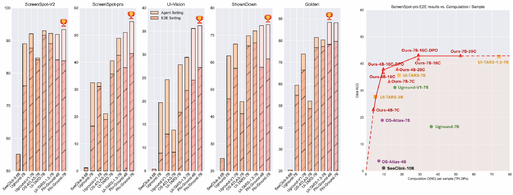

# Phi-Ground

<p align="center">
   <a href="https://zhangmiaosen2000.github.io/Phi-Ground/" target="_blank">🤖 HomePage</a> | <a href="https://arxiv.org/abs/2507.23779" target="_blank">📄 Paper </a> | <a href="" target="_blank"> 😊 Model </a> | <a href="" target="_blank"> 😊 Eval data </a> 
</p>

Home page for Microsoft Phi-Ground tech-report




## Release Plans

- [ ] [Phi-Ground-4B-7C]()
- [ ] Evaluation code for benchmarks
- [ ] [GPT-4O & O4-mini's planning data for evaluation]()

Please stay tuned!

## Citation
```
@article{zhang2025phi,
  title={Phi-Ground Tech Report: Advancing Perception in GUI Grounding},
  author={Zhang, Miaosen and Xu, Ziqiang and Zhu, Jialiang and Dai, Qi and Qiu, Kai and Yang, Yifan and Luo, Chong and Chen, Tianyi and Wagle, Justin and Franklin, Tim and others},
  journal={arXiv preprint arXiv:2507.23779},
  year={2025}
}
```
